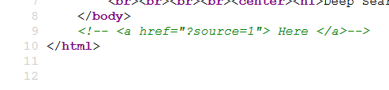
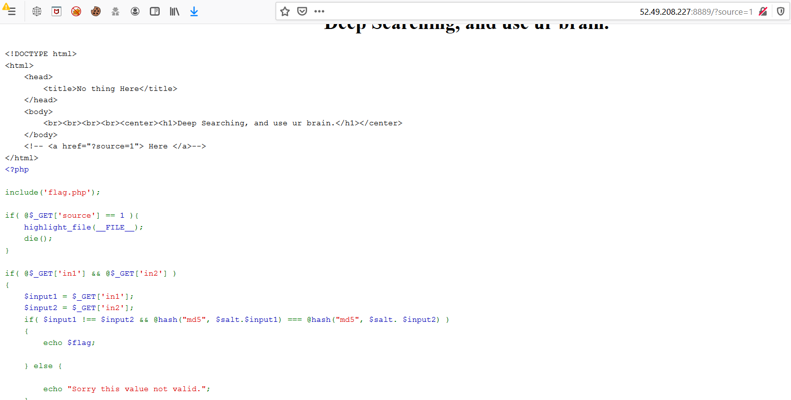
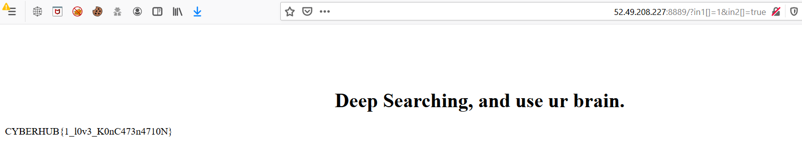

# Concatenate

It may sound strange at first once you find it, be careful when you read it.

http://52.49.208.227:8889

Flag format is CYBERHUB{...}

# Writeup

When you access the website, view the source code of the index page

You will see a commented line have a link with parameter called source



Accessing this link will view the PHP source code of the page 



1 - The script will check if you have two parameters **in1** and **in2** 

2 - Then it will check if the **in1** and **in2** doesn't have the same value, if they equal will print **Sorry this value not valid**

3 - Then it will hash the two values to MD5 with a hidden salt exists in flag.php file

4 - After that will check if the first hash of **in1** equal the second hash of **in2**, if equal will print the flag

5 - You can bypass this trick by change the parameters to arrays [Type juggling, because hash function needs a string] with different values to bypass the 1st condition

```
52.49.208.227:8889/?in1[]=1&in2[]=anything
```



**Flag** :  CYBERHUB{1_l0v3_K0nC473n4710N}
