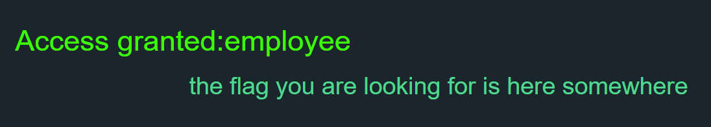

# Fake Browser

The company employees are using the company's special browser to view the website content. Can you impersonate them and access the flag?

http://52.209.27.79:8889

Flag format is CYBERHUB{...}

# Writeup


When you access the website, the website will tell you


```
 Hi User, access limited for company browser
```


 
 

That's mean you have to change your **user-agent** to the company name


```
CyberSec Inc
```

 
 

Now you have accessed successfully, but the website tell you the flag is hidden !


 


You can find the hidden flag in the header **x-flag** WOOHA


 
 
 
 **Flag** : CYBERHUB{W3lcomeC0mpanyUs3R}
 
