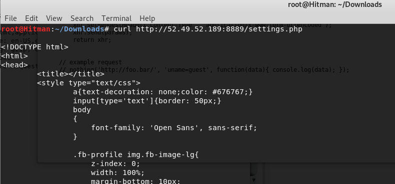
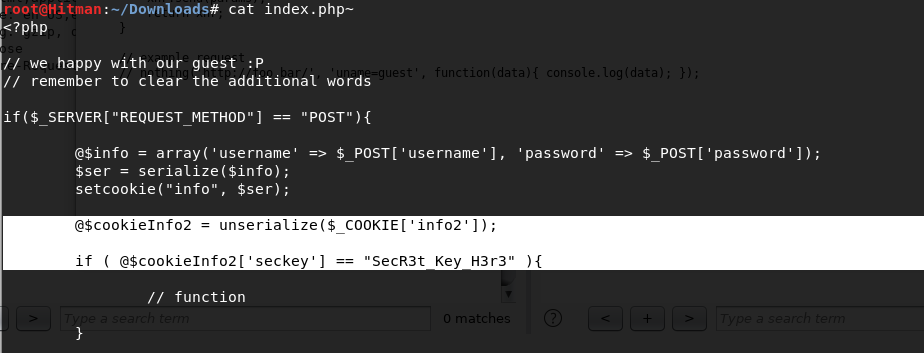
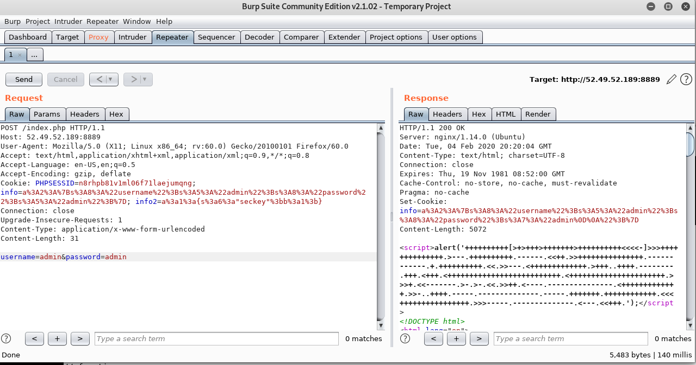
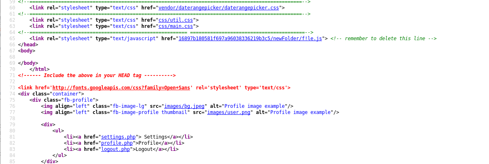
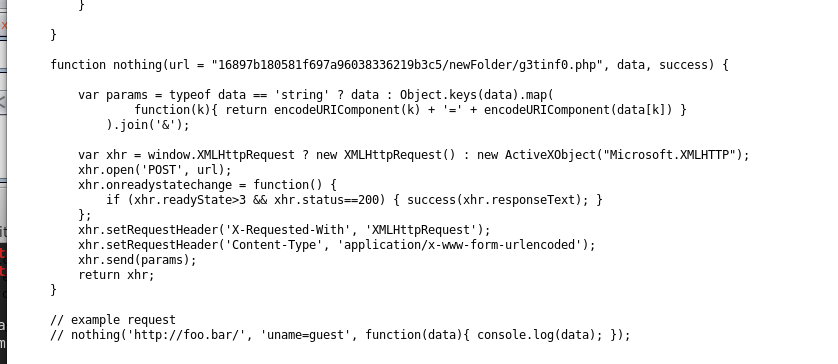
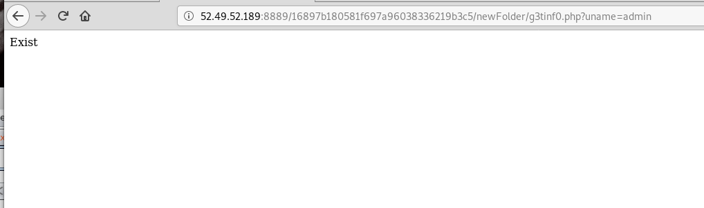
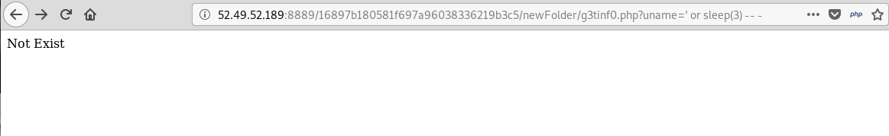
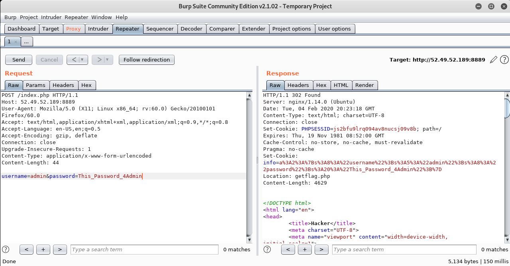
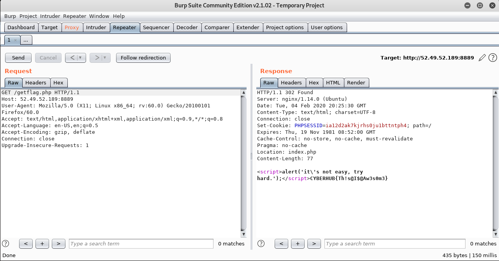

# Find Me

The flag is accessible for admin only, there is always a way but it's hard to get.

http://52.49.52.189:8889

Flag format is CYBERHUB{...}

# Writeup

When you access the website, you will see a login page


I tried to login by default creds, but nothings works for me


Then I fuzz the paths of the website and find many interesting paths


```
settings.php profile.php index.php~ index.php
```

Now you can solve the first step by two ways :


1 - The first one is to exploit the **open redirect** vulnerability by download the source code of **settings.php**





And you will see the JS path for the coming step ..


2 - The second way is to download the backup file called **index.php~** and try to exploit the type juggling vulnerability


When you download it, you will find a **type juggling** in the second check of **info2** cookie





You can exploit it by **type juggling** in serialization of seckey value by put this value on cookie called **info2**


```
Cookie: info2=a%3A1%3A%7Bs%3A6%3A%22seckey%22%3Bb%3A1%3B%7D
```




You can see in the response, now you have a string encoded by **Brain F-CK**


You can decode it online and you will find the password of the user **guest**


Now after finding the password, login using the found credentials and go to **settings.php**


You will find a JS file in the source code





When you open the file, you see PHP path and a parameter called **uname** in JS code





Now try to access the link with the parameter **uname**, you will discover it checks the username if exist or not





This script is vulnerable by **Time Based SQLi** 





You can exploit it manually by using **like method**, or use **SQLMAP** tool


```
sqlmap -u "http://52.49.52.189:8889/16897b180581f697a96038336219b3c5/newFolder/g3tinf0.php?uname=hitman' * -- -" --dbs
```


Now extract all the data, and get the admin's password from the database


```
admin : This_Password_4Admin
```

After login, you will see a header called **Location**, will redirect you to **getflag.php**





Now finally you got the flag WOOHA 





**Flag** : CYBERHUB{Th!s@I$@Aw3s0m3}


