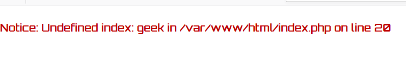
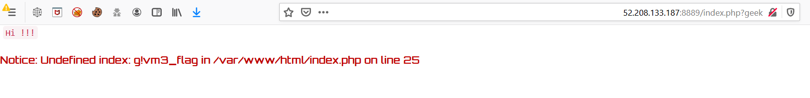
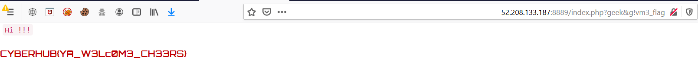

# Geeks Zone

You need to prove that you are a geek to get the flag!

http://52.208.133.187:8889

Flag format is CYBERHUB{...}

# Writeup

When you access the website, you will see an error **Undefined index: geek**
 
 

That's mean there is parameter called **geek** doesn't have a value, we will try to add it in GET request

```
index.php?geek
```

 

Now we have same error again but with another parameter called **g!vm3_flag**, let's add to the same GET request

 

WOOHA we got the flag :)

**Flag** : CYBERHUB{YA_W3Lc0M3_CH33RS} 
