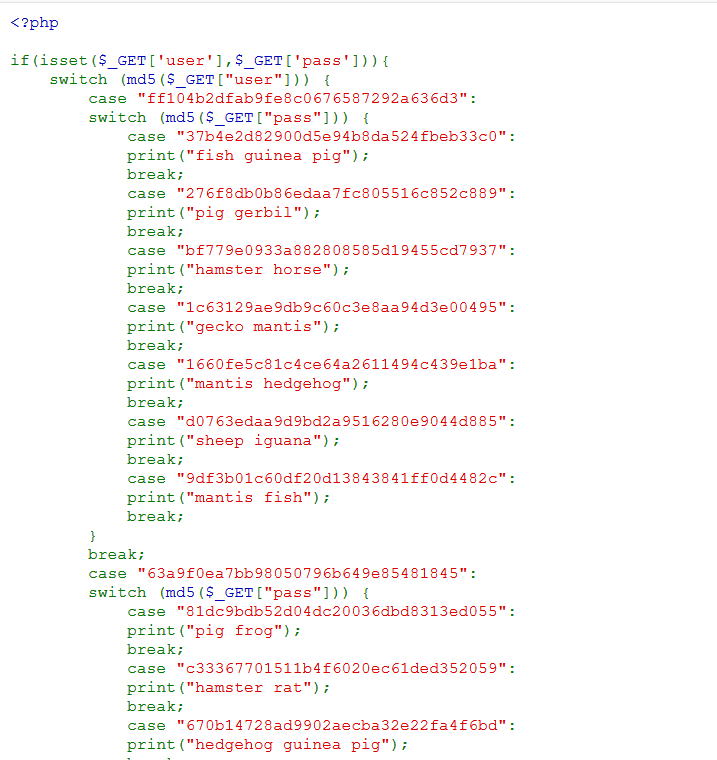
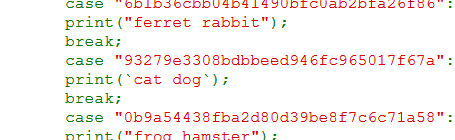
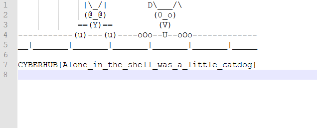

# Tick on pet

Can you find the flag? It's all in the code!

http://99.81.18.226:8889

Flag format is CYBERHUB{...}

# Writeup


When you access the website, you will see many many many many ............ MD5 hashes :P





But if you focus on the name of the challenge, and read every line 


You will find there is backtick [ Backtick used in system execution ] 


```
            print(`cat dog`);
```





That's mean it will cat a file called **dog**


Try to access the file **dog** from the browser, and you will find the flag WOOHA!





**Flag** : CYBERHUB{Alone_in_the_shell_was_a_little_catdog}


