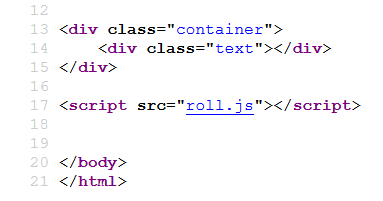
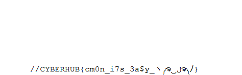

# FACES

You may see many faces, try to turn them

http://99.80.119.141:8889/

Flag format is CYBERHUB{...}

# Writeup

When you access the website, view the source code of the index page

You will see a javascript file called **roll.js**

You will find the flag in the bottom of the javascript file

**Flag** : CYBERHUB{cm0n_i7s_3a$y_ヽ༼ຈل͜ຈ༽ﾉ}
